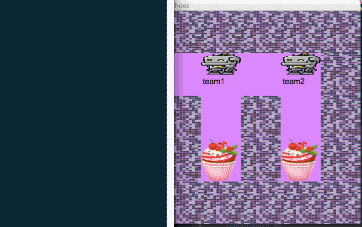

Network Games
=============

I was introduced to [Karel the robot](https://en.wikipedia.org/wiki/Karel_(programming_language),
and liked it quite a bit. However, it's based in Java and I'm teaching Ruby (not a problem, except
that I want something for very new beginners, so giving them 2 languages, and trying to explain
types to them seems difficult), and I struggled for quite a while getting the environment to work
properly, and I felt like the goal was a little ambiguous.

So, this is an attempt to do something similar (differs in terms of goal and pedagogy, but similar
in terms of the environment). It would be a game that they can join and play by creating a client
to talk to it through HTTP. I'd give them the code to send HTTP requests, and then they could
just play with it in the console, or they could build some abstractions. This part should be
within their reach, because we're starting out with JSON data structures, and after I magic away
how to talk through HTTP, they would just be left with a visual on the screen and a bunch of
hashes and arrays and things.


Games
-----

Currently there is only one game, "Cake Eater". The goal is to run around the board discovering cake
and then eating it, obviously. If I get it to a usable point and they enjoy it, then more may come.


Cake Eater Client
=================

Lets revisit the [Cake Eater](https://github.com/JoshCheek/network_games)
API for our pairing project. You and your pair will need to write a client for it.
I'll provide the structure you should choose, to speed it along and share how
I think things should be designed :)



The structure
-------------

* Client
  * This just talks to the API, it's like the twitter client you use when you want to query Twitter.
  * We make it because we don't want to have HTTP request logic all over our codebase,
    we just want that in one place. This will allow us to say "move the robot north" without worrying
    about the details of how its done.
  * We keep it separate from the others so that it can be generally useful,
    it knows about the API, not about the details of our use case.
* State
  * Our logic will want to keep track of places its been and things its seen.
    The state is where we will store that information.
  * You'll have to find a structure that stores these things
    (I do it by looking at what I want to give the logic when I test it)
  * We pull it out of the logic, because state is the most common thing I've seen that
    things get coupled to. When things are difficult, the reason is usually because they depend on state.
* Logic
  * This will receive the state and return a move.
  * Nice and simple, first make it super simple, it moves north if it can, east if it can, south if it can, west if it can.
  * That way you have something that can play the game.
* Runner
  * This will tie the other three pieces together.
  * We'll leave it untested since it depends on everything.
  * It will initialize the client, state, and logic
  * It will ask the logic for a move by giving it the state,
    then it tells the client to make the move that the logic wants.
  * When the response comes back, it gives it to the state to be updated.
  * Then it prompts the logic for another move.


Querying Example
----------------

Here is an example of how to hit the API using RestClient.
In our case, we move the Robot north.

```ruby
require 'rest-client'
require 'json'

user     = 'team1'
password = 'secret'
action   = 'move_north'
base_url = "localhost:3000/cake_eater"
endpoint = "#{base_url}/robots/#{user}"    # => "localhost:3000/cake_eater/robots/team1"
payload  = JSON.dump({'action' => action}) # => "{\"action\":\"move_north\"}"

request = RestClient::Request.new(
  method:   :get,
  url:      endpoint,
  user:     user,
  password: password,
  payload:  payload,
)
response = request.execute
JSON.parse(response.body)
# => {"name"=>"team1", "score"=>0, "x"=>9, "y"=>10, "plan"=>nil,
#     "actions"=> ["eat_cake", "move_north", "move_east", "move_south", "move_west"],
#     "grid"=> [{"x"=>8,  "y"=>9,  "contents"=>[{"type"=>"wall"}]},
#               {"x"=>9,  "y"=>9,  "contents"=>[]},
#               {"x"=>10, "y"=>9,  "contents"=>[{"type"=>"wall"}]},
#               {"x"=>8,  "y"=>10, "contents"=>[]},
#               {"x"=>9,  "y"=>10, "contents"=>[{"type"=>"robot", "name"=>"team1"}]},
#               {"x"=>10, "y"=>10, "contents"=>[{"type"=>"wall"}]},
#               {"x"=>8,  "y"=>11, "contents"=>[{"type"=>"cake"}]},
#               {"x"=>9,  "y"=>11, "contents"=>[{"type"=>"cake"}]},
#               {"x"=>10, "y"=>11, "contents"=>[{"type"=>"wall"}]}]}
```


The API
-------

#### GET `/cake_eater`

* 200 OK with contents of the leaderboard, status, and the amount of cake remaining

```ruby
{"status"=>"in_progress",
 "cake_remaining"=>41,
 "leaderboard"=>
  [{"name"=>"team1", "score"=>0}, {"name"=>"team2", "score"=>0}]}
```


#### GET `/cake_eater/robots/:robot_name`

* 401 Unauthorized unless there is a header with the token
* 403 Forbidden if the username/password do not match the robot they are requesting
* 404 Not Found if the robot has not been registered
* 200 OK if the robot can look around, body includes name, score, coords, plan, a grid of nearby tiles, and available actions

```ruby
{"name"=>"team1",
 "score"=>0,
 "x"=>9,
 "y"=>10,
 "plan"=>nil,
 "grid"=>
  [{"x"=>8, "y"=>9, "contents"=>[{"type"=>"wall"}]},
   {"x"=>9, "y"=>9, "contents"=>[]},
   {"x"=>10, "y"=>9, "contents"=>[{"type"=>"wall"}]},
   {"x"=>8, "y"=>10, "contents"=>[]},
   {"x"=>9, "y"=>10, "contents"=>[{"type"=>"robot", "name"=>"team1"}]},
   {"x"=>10, "y"=>10, "contents"=>[{"type"=>"wall"}]},
   {"x"=>8, "y"=>11, "contents"=>[{"type"=>"cake"}]},
   {"x"=>9, "y"=>11, "contents"=>[{"type"=>"cake"}]},
   {"x"=>10, "y"=>11, "contents"=>[{"type"=>"wall"}]}],
 "actions"=>["eat_cake", "move_north", "move_east", "move_south", "move_west"]}
```

#### PUT `/cake_eater/robots/:robot_name`

* 401 Unauthorized unless there is a header with the token
* 403 Forbidden if the username/password do not match the robot they are commanding
* 404 Not Found if the robot has not been registered
* 400 if the action is not valid
* 200 OK
  when the move is technically valid, it plans the move and sets the body to match the get request
  performs the move once the move time is hit
  does not countdown after the game is over (PENDING: Not yet implemented)
  overwrites the old move if the move time hasnt been hit yet
  valid moves: `eat_cake`, `move_north`, `move_east`, `move_south`, `move_west`

```ruby
{"status"=>"in_progress",
 "cake_remaining"=>41,
 "leaderboard"=>
  [{"name"=>"team1", "score"=>0}, {"name"=>"team2", "score"=>0}]}
```

Testing RestClient
------------------

Use [WebMock](https://github.com/CodePlatoon/curriculum/blob/a4ffa867c2f657676fe7fafefae4625402587bc8/phase2/testing_with_web_requests.md#stubbing-with-webmock)
for this.


Where to start:
---------------

**Use my runner to guide your design.
Try running it to see what the first thing should do.
Use the runner to guide your tests and design :)**

```ruby
module CakeEater
  class Runner
    attr_reader :state, :client, :after_move
    def initialize(state, client, &after_move)
      @state      = state
      @client     = client
      @after_move = after_move || Proc.new { |move| }
    end

    def run
      state.add_data(client.look_around)
      loop do
        move = CakeEater::Logic.new(state).get_move
        after_move.call(move)
        case move
        when :finished   then break
        when :eat_cake   then data = client.eat_cake
        when :move_north then data = client.move_north
        when :move_east  then data = client.move_east
        when :move_south then data = client.move_south
        when :move_west  then data = client.move_west
        end
        state.add_data data if data
      end
    end
  end
end


client = CakeEater::Client.new(
  base_url: 'localhost:3000/cake_eater',
  user:     'team1',
  password: 'secret',
)

p client.status
# => {"status"=>"in_progress",
#     "cake_remaining"=>41,
#     "leaderboard"=>
#      [{"name"=>"team1", "score"=>0}, {"name"=>"team2", "score"=>0}]}

state  = CakeEater::State.new
runner = CakeEater::Runner.new(state, client) do |move|
  puts move
end
runner.run
```
